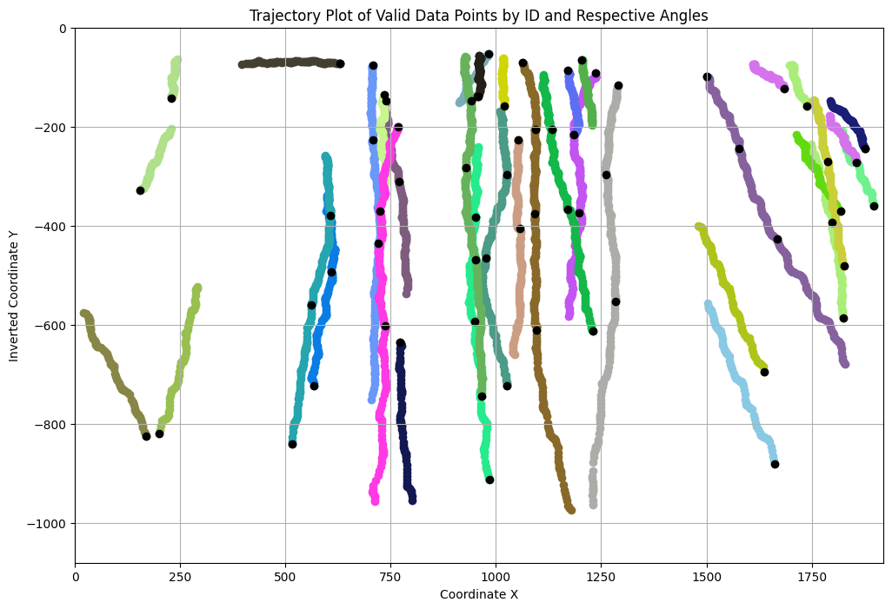
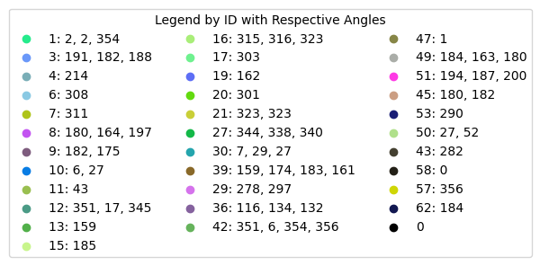

# Innovative-Gait-Acquisition-System
This repository implements an innovative gait acquisition system with a Sequence Quality Analysis Module (SQAM) that captures high-quality gait sequences and calculates displacement angles relative to the camera in real time. Developed to optimize gait acquisition for biometric recognition in monitoring, security, and access control scenarios.


<div align="center">
  
  <br>
  
  <br>
  <div style="display: flex; justify-content: center; align-items: center;">
    
    
  </div>
</div>


## Getting Started
Please see [0.get_started.md](docs/0.get_started.md). The following tutorials are also provided for your reference:
- [Prepare dataset](docs/1.prepare_dataset.md)
- [Object detector](docs/2.prepare_object_detector.md)
- [Acquisition system](docs/3.prepare_acquisition_system.md)


## Citation
```
Under Publication
```