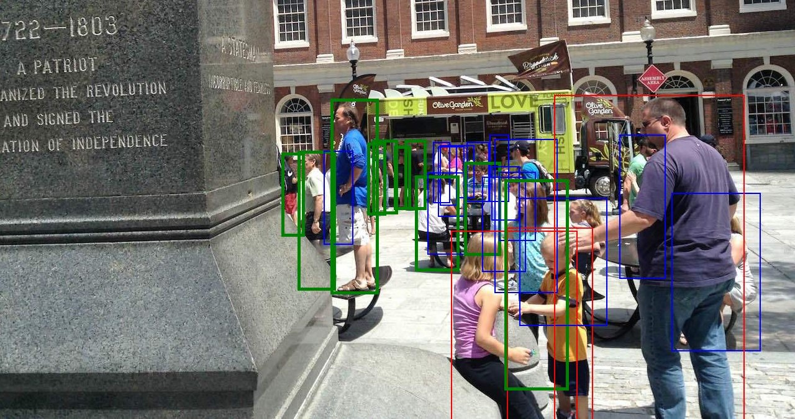

# Prepare Dataset
Before training or evaluating the object detector (YOLOv8), it is necessary to transform the dataset and its annotations into the required folder/format structure. Additionally, we aim to focus the object detector solely on detecting fully visible human bodies that are entirely within the image boundaries and not significantly obstructed by other objects or people. 

## CrowdHuman
CrowdHuman is a large dataset designed to enhance human detection in crowded scenarios. It comprises 15,000 training images, 4,370 validation images, and 5,000 testing images. The dataset includes approximately 470,000 human instances, with an average of 22.6 persons per image, annotated with three bounding box types: head (**hbox**), visible-region (**vbox**), and full-body (**fbox**). Its extensive annotations, covering occlusions and crowd scenarios, make it a valuable resource for training and evaluating detection models.

## Preprocess
Dataset URL: https://www.crowdhuman.org/
- Original
    ```
    annotation_train.odgt
    annotation_val.odgt
    CrowdHuman_test.zip
    CrowdHuman_train01.zip
    CrowdHuman_train02.zip
    CrowdHuman_train03.zip
    CrowdHuman_val.zip
    ```
- Run `python object_detector/datasets/CrowdHuman/pretreatment.py`.
- Processed
    ```
    CrowdHuman-processed
        images
            Train
                name1.jpg (image)
                ......
            Validation
                name2.jpg (image)
                ......
        labels
            Train
                name1.txt (annotations of name1.jpg)
                ......
            Validation
                name2.txt (annotations of name2.jpg)
                ......
        images_test
            name3.jpg (image)
            ......
    ```

- **Annotation Format**
    - Original: `[x_min, y_min, width, height]`
    - Normalized: `[x_center, y_center, width_normalized, height_normalized]`

### How to Use
Suppose you have downloaded the original dataset. Next, you need to ensure that the path to the root of the original dataset and the root for the processed dataset is correctly set in the configuration file [CrowdHuman.yaml](../object_detector/datasets/CrowdHuman/CrowdHuman.yaml).


## Detailed Config

### data_cfg
* Data Configuration
>
>   * Args
>       * dataset_input_root: The path of storing the original CrowdHuman dataset files.
>       * dataset_output_root: The path to store the processed CrowdHuman dataset files.
>       * num_workers: The number of workers to process data.
----

### data_cfg
* Filter Configuration
>
>   * Args
>       * max_occlusion_ratio: The ratio obtained by dividing the area of **vbox** by the area of the **fbox**. This value ranges from 0 to 1, where: 0 -> The person is completely occluded; 1 -> The person is fully visible, with no occlusion.
>       * keep_images_without_annotations: If `True`, images that have no annotations after the filtering process will still be included in the training of the object detector.
----

### Example
```yaml
data_cfg:
  dataset_input_root: your_path
  dataset_output_root: your_path 
  num_workers: 1

filtering_cfg:
  max_occlusion_ratio: 0.7
  keep_images_without_annotations: true #Given the inherent imperfections in manual annotations, it has proven beneficial to include negative images, helping the model not to detect people who do not meet the defined criteria
```

**Note:**
At the end of the preprocessing, the `Path` in the file [config.yaml](../object_detector/config.yaml) is updated. This file provides the YOLO model with the necessary information to define the class and locate the processed datasets for training, validation, and inference.


## Example of resulting filtered annotations

As an example, the next Figure shows all the **fbox** represented by three colors. In red, the **fbox** excluded for not respecting the image boundaries; in blue, the **fbox** excluded because the people in question are not sufficiently visible (using `max_occlusion_ratio: 0.7`); and in green, all the **fbox** that are included to train the object detection model.

<div align="center"></div>