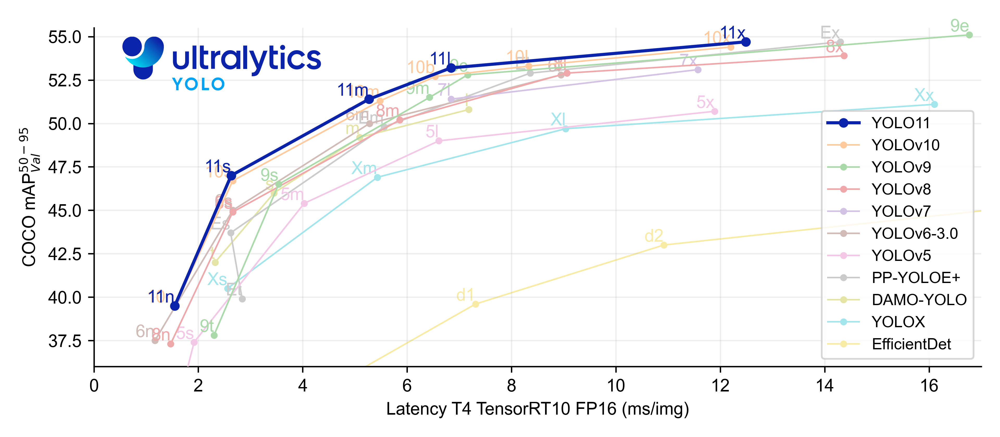

# Prepare Object Detector
To run the entire acquisition system, the selected object detector must first be trained and evaluated.

## Ultralytics YOLO11 🚀
YOLO11, released in October 2024, is the latest in the Ultralytics YOLO series, offering cutting-edge accuracy, speed, and efficiency. Building on previous versions, it features improved architecture and training methods, making it ideal for diverse computer vision tasks, including object detection.

<div align="center"></div>

**For more information:** ```https://docs.ultralytics.com/pt/models/yolo11/```


## Train
Train a model by
  ```
  python object_detector/Yolo/run_model.py --phase train
  ```
- `--phase` Specified as `train`.

## Test
Evaluate the trained model by
  ```
  python object_detector/Yolo/run_model.py --phase test
  ```
- `--phase` Specified as `test`.

**Note:**
The `Train` command also presents evaluation results of the model, so it is not necessary to run the `Test` command to evaluate the model. It was included for the need to perform additional specific tests.


## Detailed Config
The arguments and parameters in the [Yolo.yaml](../object_detector/Yolo/Yolo.yaml) configuration file can be added or removed based on the requirements and options described in the documentation. Please ensure to review the documentation to understand the available parameters and their usage.

### train_cfg
* Train Configuration
>
>   * Args
>       ```
>       https://docs.ultralytics.com/modes/train/#train-settings
>       ```
----

### val_cfg
* Validation Configuration
>
>   * Args
>       ```
>       https://docs.ultralytics.com/modes/val/#arguments-for-yolo-model-validation
>       ```
----


### Example
```yaml
train_cfg:
  model: yolo11n.pt # load a pretrained model (recommended for training)
  data: object_detector/config.yaml
  epochs: 100
  patience: 10
  batch: 16
  device: 0
  workers: 8
  project: object_detector/outputs/train
  name: yolo11n
  exist_ok: true
  single_cls: true
  plots: true

val_cfg:
  data: object_detector/config.yaml
  batch: 16
  save_json: True
  conf: 0.4 #Only BBoxes with a confidence above 0.4 will be considered to evaluation
  iou: 0.7
  device: 0
  plots: true
  split: val #By default, it uses the validation set of CrowdHuman. If 'split: test' is specified, the evaluation is conducted on the CrowdHuman test set.
  project: object_detector/outputs/evaluation
  name: yolo11n
```